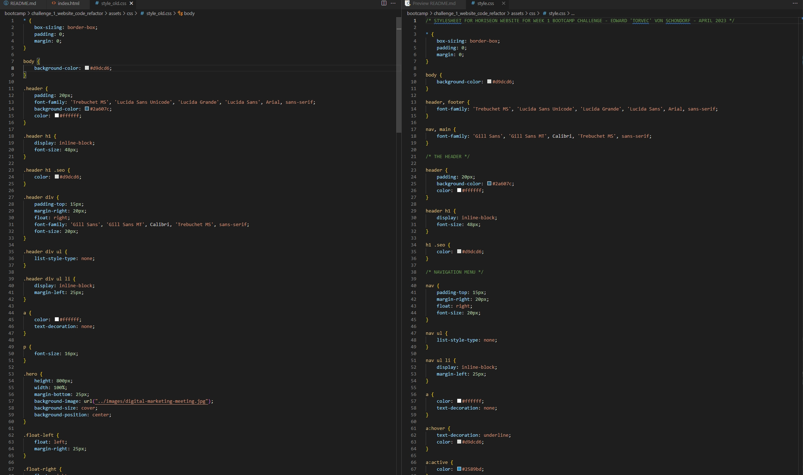

# HoriSEOn Website Refactor
A UC Berkley Full Stack Web Development Bootcamp Week 01 Challenge

## Description

The week 01 bootcamp challenge was to refactor the HTML and CSS code for the Horiseon company web page. The original code used non-semantic HTML and the CSS had a lot of redundant code that needed to be removed. The overall look of the site remained the same after all of the changes were made but the underlying code was more semantic and efficient.

## GitHub Pages

Visit the GitHub pages link to see website: [HoriSEOn Refactor](https://torvec.github.io/m1_horiseon_refactor/)

## Visuals

HTML example (Left side is the starter code, Right side is refactored code):

CSS example (Left side is the starter code, Right side is refactored code):

## Usage

This page is used for grading purposes by the UC Berkley coding bootcamp staff.

## Credits

- Code Refactor Starter Code: [urban-octo-telegram repo](https://github.com/coding-boot-camp/urban-octo-telegram)
- Edward Von Schondorf

## Features

- Semantic HTML elements
- External Stylesheet

## Project Status

Completed April 2023